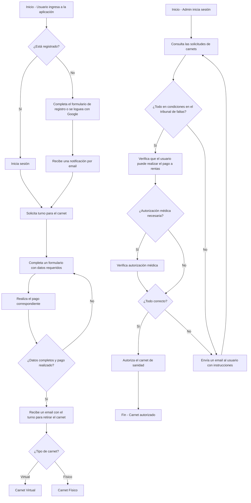
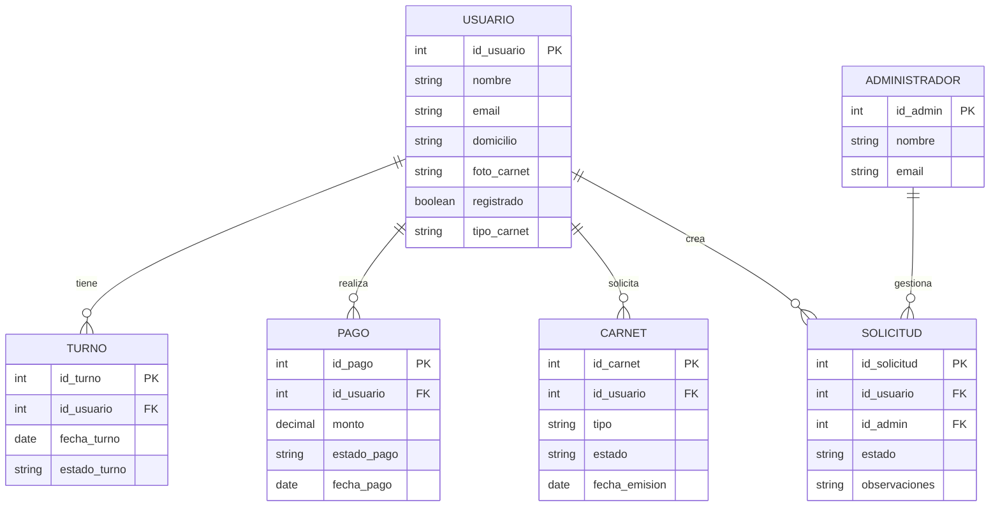
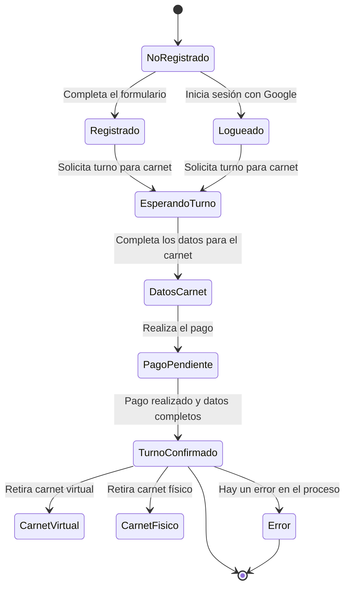
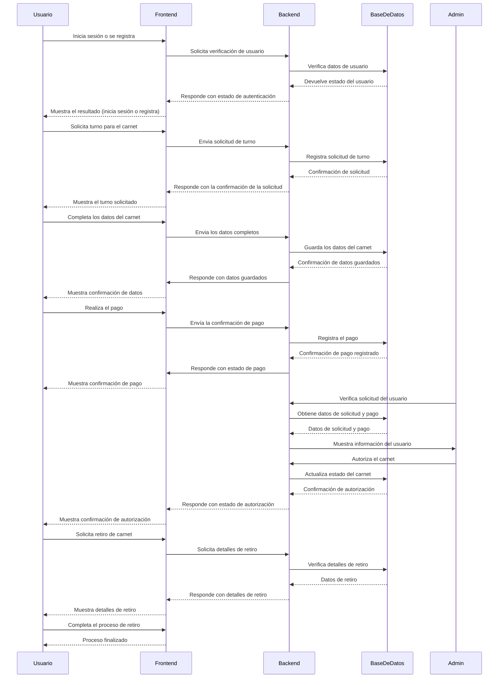

# Henry-M3

## Diagrama de flujo

### Descripción detallada de cada sección:

## Sección Usuario

Esta sección detalla el flujo de acciones que realiza un usuario al ingresar a la aplicación para solicitar su carnet.

**1. Inicio - Usuario ingresa a la aplicación:**

- Representa el punto de partida del usuario al acceder a la plataforma.

**2. ¿Está registrado? (Decisión):**

- Se verifica si el usuario ya tiene una cuenta en el sistema.

* **Si está registrado:** Inicia sesión con sus credenciales existentes.
* **Si no está registrado:**
  - Completa un formulario de registro o utiliza la opción de logueo con Google.
  - Tras registrarse, recibe un email de confirmación.

**3. Solicita turno para el carnet:**

- El usuario solicita un turno para obtener su carnet de sanidad.

**4. Completa un formulario con los datos requeridos:**

- Rellena los datos necesarios, como información personal, antecedentes médicos, etc.

**5. Realiza el pago correspondiente:**
El sistema guía al usuario para realizar el pago del trámite.

**6. ¿Datos completos y pago realizado? (Decisión):**

- **Sí:** El sistema procesa la información y envía un email con el turno para retirar el carnet.
- **No:** Se solicita al usuario que complete los pasos faltantes.

**7. ¿Tipo de carnet? (Decisión Opcional):**

- **Carnet Virtual:** El usuario opta por recibir una versión digital.
- **Carnet Físico:** El usuario elige recoger el carnet físico.

## Sección Admin

Esta sección describe las acciones y decisiones que toma un administrador para procesar las solicitudes de los usuarios.

**1. Inicio - Admin inicia sesión:**

- El administrador accede al sistema con una cuenta de privilegios.

**2. Consulta las solicitudes de carnets:**

- Visualiza las solicitudes realizadas por los usuarios.

**3. ¿Todo en condiciones en el tribunal de faltas? (Decisión):**

- **Sí:** Se verifica que el usuario esté habilitado para proceder con el trámite (sin multas u observaciones pendientes).
- **No:** Se envía un email al usuario con instrucciones específicas para corregir los problemas.

**4. Verifica que el usuario puede realizar el pago a rentas:**

- Revisa si el usuario está autorizado para avanzar con el pago correspondiente.

**5. ¿Autorización médica necesaria? (Decisión Opcional):**

- **Sí:** Verifica que el usuario cuenta con una autorización médica válida.
- **No:** Procede con el trámite.

**6. ¿Todo correcto? (Decisión):**

- **Sí:** Autoriza el carnet de sanidad y lo marca como aprobado en el sistema.
- **No:** Envía un email al usuario con instrucciones para corregir los problemas.

**7. Fin - Carnet autorizado:**

- Una vez que todos los requisitos son cumplidos, el administrador autoriza el carnet.

## Relación entre Usuario y Admin

1. El usuario completa el proceso inicial y el administrador valida su información.
2. El administrador puede detener el flujo del usuario si encuentra problemas, enviando notificaciones para corregirlos.
3. Al finalizar el proceso, el usuario recibe su carnet (físico o digital), siempre sujeto a la autorización del administrador.

## Diagrama de datos

## Descripción del Diagrama:

**Entidades y sus descripciones**

**1. USUARIO**
Esta tabla representa la información básica de los usuarios que interactúan con la aplicación.

**- Atributos:**
**- id_usuario (PK):** Identificador único de cada usuario.
**- nombre:** Nombre completo del usuario.
**- email:** Correo electrónico del usuario (debe ser único en la tabla).
**- registrado:** Indica si el usuario está registrado (booleano: TRUE o FALSE).
**- tipo_carnet:** Especifica si el usuario solicita un carnet físico o virtual.
**- foto_perfil:** Almacena la ruta de la foto del perfil del usuario (en formato URL) o la imagen como dato binario (si se usa tipo BLOB).

**2. TURNO**
La tabla Turno contiene información sobre los turnos solicitados por los usuarios.

**- Atributos:**
**- id_turno (PK):** Identificador único del turno.
**- id_usuario (FK):** Clave foránea que conecta el turno con un usuario específico.
**- fecha_turno:** Fecha asignada al turno.
**- estado_turno:** Estado del turno (por ejemplo, pendiente, confirmado).

**3. PAGO**
La tabla Pago almacena detalles de los pagos realizados por los usuarios para los trámites.

**- Atributos:**
**- id_pago (PK):** Identificador único del pago.
**- id_usuario (FK):** Clave foránea que conecta el pago con un usuario específico.
**- monto:** Cantidad pagada por el usuario.
**- estado_pago:** Estado del pago (realizado, pendiente).
**- fecha_pago:** Fecha en la que se realizó el pago.

**4. CARNET**
La tabla Carnet representa los carnets solicitados y emitidos a los usuarios.

**- Atributos:**

- **id_carnet (PK):** Identificador único del carnet.
- **id_usuario (FK):** Clave foránea que conecta el carnet con un usuario específico.
- **tipo:** Indica si el carnet es virtual o físico.
- **estado:** Estado del carnet (autorizado, pendiente).
- **fecha_emision:** Fecha en la que se emitió el carnet.

**5. ADMINISTRADOR**
La tabla Administrador contiene los datos de los administradores que gestionan las solicitudes.

**- Atributos:**

- **id_admin (PK):** Identificador único del administrador.
- **nombre:** Nombre del administrador.
- **email:** Correo electrónico del administrador.

**6. SOLICITUD**
La tabla Solicitud vincula usuarios con administradores y detalla el estado de las revisiones.

**- Atributos:**

- **id_solicitud (PK):** Identificador único de la solicitud.
- **id_usuario (FK):** Clave foránea que conecta la solicitud con un usuario específico.
- **id_admin (FK):** Clave foránea que conecta la solicitud con un administrador específico.
- **estado:** Estado de la solicitud (aprobado, rechazado).
- **observaciones:** Notas o comentarios adicionales sobre la solicitud.

### Relaciones

1. **USUARIO** tiene relaciones de uno a muchos con:

   - **TURNO:** Un usuario puede solicitar varios turnos.
   - **PAGO:** Un usuario puede realizar múltiples pagos.
   - **CARNET:** Un usuario puede tener varios carnets.
   - **SOLICITUD:** Un usuario puede generar múltiples solicitudes.

2. **ADMINISTRADOR** tiene una relación de uno a muchos con **SOLICITUD:**

- Un administrador gestiona múltiples solicitudes.

3. **SOLICITUD** conecta usuarios y administradores:

- Relaciona el proceso de revisión de un administrador con un usuario.

# Tareas principales del Frontend, Backend y Base de Datos

## Frontend

El frontend es la parte de la aplicación con la que los usuarios interactúan directamente. Las tareas principales del frontend incluyen:

### 1. Diseño y UI/UX

- Crear las pantallas que permitirán al usuario:
  - Iniciar sesión o registrarse.
  - Completar los formularios (registro, datos del carnet, pago).
  - Solicitar el turno para el carnet.
  - Visualizar los detalles del carnet, el estado del turno y los pagos realizados.
  - Subir y mostrar la foto de perfil.
- Implementar un diseño visual atractivo y amigable.
- Asegurarse de que la aplicación sea **responsive** y funcione bien en dispositivos móviles y de escritorio.
- Crear animaciones y transiciones (por ejemplo, para mostrar el turno o el carnet).

### 2. Formularios de entrada

- Validación en el cliente para asegurar que los datos del formulario sean correctos antes de enviarlos al backend (por ejemplo, validar el email, que el monto del pago sea positivo, que los datos del carnet sean completos).
- Enviar los datos del formulario al backend (por ejemplo, cuando se registra un usuario o se solicita el carnet).

### 3. Autenticación y manejo de sesiones

- Implementar la autenticación de usuario:
  - Usar JWT (JSON Web Tokens) o cookies para la gestión de sesiones y autenticación de usuarios.
- Integrar la opción de inicio de sesión con Google.
- Mostrar mensajes de error si el usuario no está autorizado o si los datos son incorrectos.

### 4. Manejo de fotos y archivos

- Permitir que el usuario suba una foto de perfil (mediante un campo de tipo `file`).
- Mostrar la foto de perfil cargada, ya sea desde la URL o al usar la imagen como blob.

### 5. Interacciones con el backend (API)

- Realizar peticiones HTTP (GET, POST, PUT, DELETE) al backend usando **fetch** o **axios**.
- Mostrar mensajes de confirmación o error cuando los procesos se completen (por ejemplo, confirmación de registro o mensaje de error si no se pudo completar la solicitud del carnet).
- Recuperar y mostrar datos del servidor (por ejemplo, los turnos disponibles, el estado de los pagos, etc.).

---

## Backend

El backend es responsable de manejar la lógica del negocio y de interactuar con la base de datos. Las tareas principales del backend incluyen:

### 1. Autenticación y autorización

- Implementar autenticación de usuario, incluyendo la verificación de credenciales y el inicio de sesión.
- Integrar el inicio de sesión con Google.
- Gestionar las sesiones de usuario (puedes usar JWT para esto).
- Validar los permisos del usuario (por ejemplo, asegurarse de que solo los administradores puedan autorizar carnets).

### 2. Lógica de negocio

- Procesar la solicitud de carnet, verificando que el usuario haya completado todos los formularios correctamente.
- Manejar el proceso de solicitud del turno, el pago y la emisión del carnet.
- Generar el correo electrónico con el turno para retirar el carnet.
- Procesar las solicitudes de los administradores, verificando los datos del usuario, el estado del pago y la autorización médica.

### 3. Integración con la base de datos

- Recibir las peticiones del frontend y realizar las consultas correspondientes a la base de datos.
- Validar y guardar la información del usuario, los pagos y los turnos en la base de datos.
- Consultar el estado de las solicitudes de los usuarios y autorizar el carnet cuando todo esté correcto.

### 4. Envío de correos electrónicos

- Configurar un servicio de envío de correos electrónicos (por ejemplo, utilizando **NodeMailer** o un servicio de terceros).
- Enviar notificaciones por email al usuario en momentos clave (registro, turno de carnet, estado del pago, etc.).
- Configurar el backend para que envíe correos con los turnos para el retiro del carnet.

### 5. Seguridad

- Asegurarse de que las rutas estén protegidas y solo los usuarios autenticados puedan acceder a ciertas funciones (por ejemplo, solicitar un carnet o ver el estado de los pagos).
- Implementar seguridad para manejar los datos sensibles (como contraseñas, pagos, etc.).
- Validar las entradas del usuario para prevenir inyecciones SQL u otros ataques.

---

## Base de Datos

La base de datos almacena toda la información relacionada con los usuarios, pagos, turnos, carnets y solicitudes. Las tareas principales relacionadas con la base de datos incluyen:

### 1. Modelado de datos

- Diseñar y crear las tablas necesarias para almacenar la información del usuario, los pagos, los turnos y las solicitudes de carnet.
- Asegurarse de que las relaciones entre las tablas estén correctamente definidas (por ejemplo, la relación entre **Usuario** y **Turno**).
- Incluir los campos necesarios como la foto de perfil (como una URL o BLOB).

### 2. Consultas y manipulación de datos

- Consultar la base de datos para verificar la información del usuario (por ejemplo, si el usuario está registrado o si su pago ha sido realizado).
- Consultar el estado del turno del usuario y si es posible emitir el carnet.
- Realizar transacciones para asegurar que el proceso de pago y solicitud del carnet sea atómico y no genere inconsistencias.

### 3. Creación de índices y optimización

- Crear índices en campos clave, como el **email** del usuario, para mejorar el rendimiento de las consultas.
- Optimizar las consultas de la base de datos para garantizar una buena performance, especialmente cuando haya un gran volumen de datos.

### 4. Seguridad y respaldo de la base de datos

- Asegurarse de que los datos sensibles estén protegidos (por ejemplo, usando hashing para las contraseñas).
- Realizar copias de seguridad periódicas de la base de datos.
- Implementar medidas para prevenir ataques como inyecciones SQL.

---

## Interacciones entre los Componentes

1. **Frontend a Backend**:

   - El frontend hace peticiones al backend para enviar datos de formularios (por ejemplo, datos del usuario, solicitud de carnet, pagos).
   - El backend valida estos datos y los guarda en la base de datos.
   - El frontend recupera los datos desde el backend (por ejemplo, el estado de la solicitud del carnet o los pagos) y los muestra al usuario.

2. **Backend a Base de Datos**:

   - El backend consulta y manipula los datos de la base de datos.
   - El backend también actualiza los registros de la base de datos (por ejemplo, marca el pago como realizado, o autoriza el carnet).

3. **Frontend a Base de Datos** (Indirectamente):
   - El frontend interactúa con el backend, que luego interactúa con la base de datos para almacenar o recuperar datos.

## Diagrama de estados

# Diagrama de Estados - Proceso de Solicitud de Carnet

Este diagrama de estados describe el flujo de trabajo de un usuario que solicita un carnet. A continuación se detalla cada uno de los estados y transiciones en el proceso:

## Estados

1. **NoRegistrado**:

   - Este es el estado inicial del sistema, cuando el usuario no está registrado. Desde aquí, el usuario puede optar por registrarse o iniciar sesión con Google.

2. **Registrado**:

   - El usuario ha completado el formulario de registro. A partir de aquí, puede solicitar el turno para obtener el carnet.

3. **Logueado**:

   - El usuario ha iniciado sesión con Google. Al igual que el estado de "Registrado", puede solicitar el turno para obtener el carnet.

4. **EsperandoTurno**:

   - El usuario ha solicitado un turno para el carnet, pero aún necesita completar los datos necesarios para procesar la solicitud.

5. **DatosCarnet**:

   - El usuario completa los datos necesarios para procesar el carnet.

6. **PagoPendiente**:

   - El usuario realiza el pago correspondiente para obtener el carnet.

7. **TurnoConfirmado**:

   - El pago y los datos han sido validados. Ahora el turno está confirmado.

8. **CarnetVirtual**:

   - El usuario puede retirar su carnet en formato virtual.

9. **CarnetFisico**:

   - El usuario puede retirar su carnet en formato físico.

10. **Error**:

- Si ocurre un error en algún paso del proceso, se redirige al estado de error.

11. **[*]**:

- Este es el estado final del flujo, indicando el cierre o término del proceso.

## Transiciones

- **NoRegistrado → Registrado**: El usuario completa el formulario de registro.
- **NoRegistrado → Logueado**: El usuario inicia sesión con Google.
- **Registrado → EsperandoTurno**: El usuario solicita el turno para el carnet.
- **Logueado → EsperandoTurno**: El usuario solicita el turno para el carnet.
- **EsperandoTurno → DatosCarnet**: El usuario completa los datos requeridos para el carnet.
- **DatosCarnet → PagoPendiente**: El usuario realiza el pago correspondiente.
- **PagoPendiente → TurnoConfirmado**: El pago se completa y los datos son validados.
- **TurnoConfirmado → CarnetVirtual**: El usuario elige retirar su carnet en formato virtual.
- **TurnoConfirmado → CarnetFisico**: El usuario elige retirar su carnet en formato físico.
- **TurnoConfirmado → Error**: Si hay algún error en el proceso, el flujo se dirige a este estado.
- **Error → [*]**: El flujo termina después de un error.
- **CarnetVirtual → [*]**: El flujo termina después de retirar el carnet virtual.
- **CarnetFisico → [*]**: El flujo termina después de retirar el carnet físico.

Este diagrama de estados representa el ciclo completo de la solicitud de carnet de un usuario, desde que ingresa al sistema hasta que obtiene su carnet (ya sea virtual o físico).

## Diagrama de ejecucion de proyecto

# Descripción del Diagrama de Ejecución del Proyecto

Este diagrama de ejecución describe el flujo de tareas principales desde el inicio hasta la finalización del proceso de solicitud y entrega de un carnet en un sistema web. A continuación, se detallan los pasos que siguen los participantes principales: **Usuario**, **Frontend**, **Backend**, **Base de Datos**, y **Admin**.

## Participantes

1. **Usuario**: La persona que interactúa con la aplicación para solicitar el carnet.
2. **Frontend**: La interfaz de usuario, que interactúa con el **Usuario** y envía las solicitudes al **Backend**.
3. **Backend**: El servidor que maneja las solicitudes del **Frontend** y se comunica con la **Base de Datos** para almacenar y recuperar la información.
4. **Base de Datos**: Donde se almacenan los datos del usuario, las solicitudes de turno y el estado del pago.
5. **Admin**: El administrador que autoriza el carnet una vez se verifica la solicitud y el pago.

## Proceso de Ejecución

### 1. **Inicio de la sesión (Usuario)**

- El **Usuario** puede iniciar sesión o registrarse a través del **Frontend**.
- Si el **Usuario** no está registrado, el sistema solicita completar el formulario o iniciar sesión con Google.
- El **Frontend** envía la solicitud de verificación de usuario al **Backend**, que consulta la **Base de Datos** para verificar los datos.
- El **Backend** responde al **Frontend** con el estado de autenticación del **Usuario**, quien recibe una confirmación en la interfaz.

### 2. **Solicitud de Turno para el Carnet**

- El **Usuario** solicita un turno para obtener el carnet a través del **Frontend**.
- El **Frontend** envía esta solicitud al **Backend**, que la registra en la **Base de Datos**.
- El **Backend** confirma que la solicitud ha sido registrada y el **Frontend** muestra la confirmación al **Usuario**.

### 3. **Completar Datos y Realizar Pago**

- El **Usuario** completa los datos necesarios para procesar el carnet a través del **Frontend**.
- El **Frontend** envía los datos al **Backend**, que los guarda en la **Base de Datos**.
- El **Usuario** realiza el pago correspondiente, y el **Frontend** envía la confirmación de pago al **Backend**.
- El **Backend** registra el pago en la **Base de Datos** y responde al **Frontend** con el estado de pago.
- El **Frontend** informa al **Usuario** que el pago ha sido registrado exitosamente.

### 4. **Autorización del Carnet por el Administrador**

- El **Admin** verifica la solicitud del **Usuario**, los datos y el pago realizado a través del **Backend**.
- El **Backend** obtiene los datos de la solicitud y el pago desde la **Base de Datos**.
- Si la información es correcta, el **Admin** autoriza el carnet.
- El **Backend** actualiza el estado del carnet en la **Base de Datos** y responde al **Frontend** con la autorización.

### 5. **Retiro del Carnet**

- Una vez autorizado el carnet, el **Usuario** solicita el retiro del carnet (virtual o físico) a través del **Frontend**.
- El **Frontend** consulta al **Backend** sobre los detalles de retiro del carnet, y el **Backend** obtiene la información de la **Base de Datos**.
- El **Frontend** muestra al **Usuario** los detalles del retiro, completando así el proceso.

### 6. **Finalización**

- El proceso finaliza cuando el **Usuario** ha completado el retiro del carnet (ya sea en formato virtual o físico).
- El **Frontend** notifica al **Usuario** que el proceso ha sido completado exitosamente.

## Conclusión

Este diagrama de ejecución describe cómo los componentes principales del sistema interactúan a lo largo de las etapas clave del proceso, desde la autenticación inicial hasta el retiro del carnet. Las interacciones entre el **Usuario**, **Frontend**, **Backend**, **Base de Datos**, y **Admin** permiten completar el proceso de manera eficiente y organizada.
